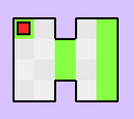
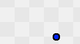
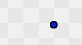
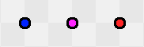

# Mapmaker guide
If you want to create a new level for **The World's
Hardest Game** you need to follow these steps:
1. Create in the `/maps` directory a folder. It must
be named like `MAPxx`, where xx is the next number
of map after the last existing one in there.
2. Create two map files in it: `MAPxx-static.map` and
`MAPxx-dynamic.json` for the static and dynamic maps
respectively.
3. Fill both maps in accordance with the next two
paragraphs.

## How to fill the static map
A typical static map looks like this:
```
7x6
0 0 0 0 0 0 0
0 3 1 0 1 4 0
0 1 1 2 1 4 0
0 1 1 2 1 4 0
0 1 1 0 1 4 0
0 0 0 0 0 0 0
```


How are interpreting each of the numbers you can
see in the table below:

| number | Description                         |
|:------:|-------------------------------------|
|   0    | Wall (tile itself doesn't render)   |
|   1    | Default tile, player can go through |
|   2    | Checkpoint tiles                    |
|   3    | Spawn tile                          |
|   4    | Finish tiles                        |

Every static map must:
- be surrounded by walls.
- have exactly one spawn tile.
- have `WIDTHxHEIGHT` of the map in the first line
of file.[^1]

## How to fill the dynamic map
Every dynamic map looks like this:
```json
{
 "0001": {...},
 "0002": {...},
 ...
}
```
Where `{...}` is some kind of dynamic object.

There are two different types of dynamic objects in
The World's Hardest Game: `enemy` and `coin`.
Also `enemy` object type has two different movement types:
`from_to` and `around`.

### coin
Below is syntax for the `coin` object type:
```json
{
 "type": "coin",
 "init_pos": [3, 4.5]
}
``` 
`enemy` object type a bit more compicated. Each one has
6 or 7 attributes in order with selected movement type.

### enemy#from_to
The enemy moves by key positions horizontally or
vertically. Here is syntax for it:
```json
{
  "type": "enemy",
  "movement_type": "from_to",
  "key_positions": [[2.5, 2], [6.5, 2], [6.5, 4], [2.5, 4]],
  "init_pos": [2.5, 3],
  "speed": 2,
  "color": 0
}
```


Every position in `key_positions` must have at least
one generic coordinate with the previous one. Also,
it's not necessary to set `init_pos` equal the first
`key_positions` element (like in [MAP02](../src/maps/MAP02/MAP02-dynamic.json)).

### enemy#around
The enemy moves around the `circle_center` point. Here is syntax
of it:
```json
{
 "type": "enemy",
 "movement_type": "around",
 "clockwise": true,
 "circle_center": [5, 3],
 "init_pos": [6, 3],
 "speed": 1,
 "color": 0
}
```


`speed` attribute is scaling depending on
the distance between `init_pos` and `circle_center`.
`circle_center` and `init_pos` should have at least
one generic coordinate with each other.

### Colors
Every enemy has a `color` attribute, which elaborates
the color of its appearance:

|     value      | color  |
|:--------------:|:------:|
| 0 (by default) |  blue  |
|       1        |  pink  |
|       2        |  red   |


[^1]: All coordinates must be in tile units,
which will later be converted to pixel units.